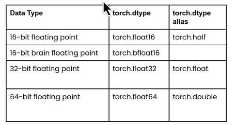
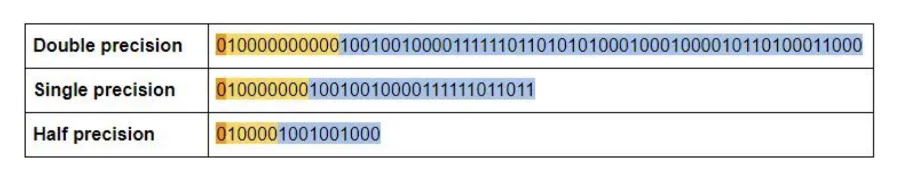
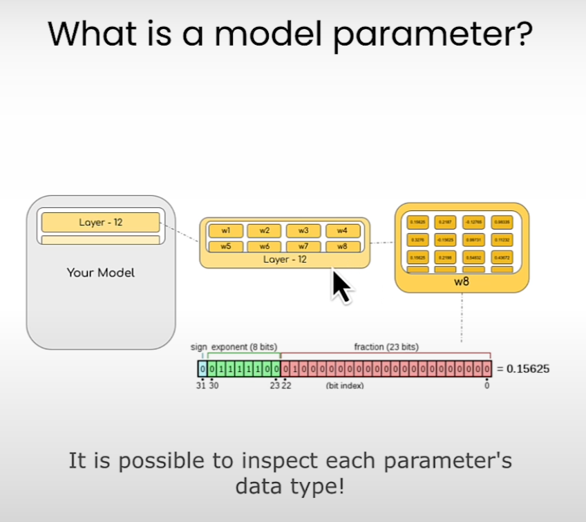
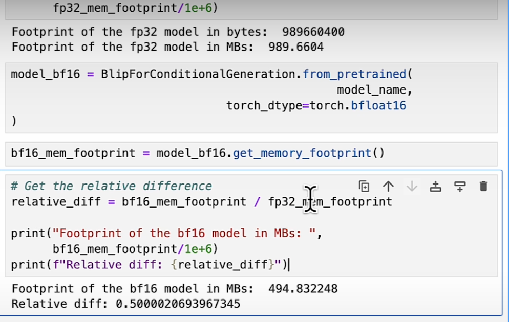

# Overview of LLM Optimizations Techniques

[TOC]

# Background

Techniques such as quantization and distilation has been used to reduce model size.

For example the **[Int8](https://arxiv.org/abs/2208.07339)** inference can reduce memory footprint of large models by a factor of 2x.

The sequencial generation process of autoregressive transformer which generates words (tokens) one at a time based on the input prompt and previous sequence, makes the GPU workload **memory-bound**, underutilizing the computation power of GPUs and limiting the serving throughput.

In order to make sure workloads are predominatly **compute-bound** at GPUs (and not memory-bound) several solutions have been proposed including **FlashAttention** and **PagedAttention** discussed below.


## FlashAttention

The attention layer is the main bottleneck in scaling longer sequences, as its runtime and memory increase quadratically in the sequence length [ref. [FlashAttention-2](https://arxiv.org/abs/2307.08691)]. 

To reduce computational requirement of attention on such long context, techniques such as ***FlashAttention*** has been proposed to reorder the attention computation and leverages classical techniques such as tilling and recomputation, to speed up and reduce memory usage from quadratic to linear in sequence length (**2-4x faster** than a standard attention implementation). 

To check the list of flash attention adopters, check https://github.com/Dao-AILab/flash-attention/blob/main/usage.md

Before diving into Flash Attention we need to introduce the GPU hardware characteristics 

##### GPU Hardware Characteristics

Main components of a modern GPU are:

- On-chip SRAM (a.k.a. as shared memory e.g. A100 19TB/s - 192KB per 108 streaming)
- HBM (High Bandwidth Memory) (e.g. A100 - 40-80GB and 1.5-2.0TB/s )
- SM (streaming multiprocessor) (e.g. A100 - 108 stream multiprocessors )
  - 1 SM - 1 Thread block -> Warp (1 warp - 32 threads)


Picture By DeepLearning Hero. How does matrix multiplication work inside GPUs - https://www.youtube.com/watch?v=wIPdrbZIeKE


Operations are executed in threads (a.k.a. kernel). Threads are organized into thread blocks, which are scheduled to run on streaming mutiprocessors (SMs)

Within each thread blocks, threads are grouped into warps ( 1 warp equal 3 threads). Threads within a warp can communicate by fast shuffe instructions or cooperate to perform matrix multiply.

Warps within a thread block can communicate by reading from and writing to shared memory. Each kernel loads inputs from HBM to registers and SRAM, computes, then writes outputs to HBM.


Picture By DeepLearning Hero. How does matrix multiplication work inside GPUs - https://www.youtube.com/watch?v=wIPdrbZIeKE


Picture by Dissecting the Ampere GPU Architecture through Microbenchmarking - https://www.nvidia.com/en-us/on-demand/session/gtcspring21-s33322/

Table below shows the comparison between certain GPU types across its main characteristics.

| GPU Type                                                     | Architecture  | SM   | HBM             | SRAM | Notes                                                        |
| ------------------------------------------------------------ | ------------- | ---- | --------------- | ---- | ------------------------------------------------------------ |
| [A100](https://www.nvidia.com/en-us/data-center/a100/)       | NVIDIA Ampere | 108  | 40 GB (1.5TB/s) |      |                                                              |
| [H100](https://developer.nvidia.com/blog/nvidia-hopper-architecture-in-depth/) | NVIDIA Hopper | 144  | 80GB(2.0TB/s)   |      | Tensor Memory Accelerator, DPX (Dinamic Programmingh) Instructions, FP8 Tensor Cores, DSMEM (Distributed Shared Memory) |
| [H200](https://www.nvidia.com/en-us/data-center/h200/)       | NVIDIA Hopper |      | 141GB (4.8TB/s) |      |                                                              |

### FlashAttention Solution

Lots of data loading turns computation in memory bound and not compute bound. 

For each attention head, to reduce memory reads/writes, **FlashAttention** uses classical tiling techniques to load blocks of query, key, and value from GPU HBM (its main memory) to SRAM (its fast cache), compute attention with respect to that block, and write back the output to HBM. This reduction in memory reads/writes brings significant speedup (2-4x) in most cases. [ref. https://www.adept.ai/blog/flashier-attention]

The figure below is from [FlashAttention paper](https://arxiv.org/pdf/2205.14135) showing on the left that FlashAttention uses tiling to prevent materialization of the large 𝑁 × 𝑁 attention matrix (dotted box) on (relatively) slow GPU HBM.

Here in the outer loop (red arrows), FlashAttention loops through blocks of the K and V matrices and loads them to fast on-chip SRAM. In each block, FlashAttention loops over blocks of Q matrix (blue arrows), loading them to SRAM, and writing the output of the attention computation back to HBM.

On the right you see the speedup over the PyTorch implementation of attention on GPT-2. FlashAttention does not read and write the large 𝑁 × 𝑁 attention matrix to HBM, resulting in an 7.6× speedup on the attention computation according to the paper.


### FlashAttention at PyTorch

PyTorch implements flash attention (https://pytorch.org/docs/stable/generated/torch.nn.functional.scaled_dot_product_attention.html). 

Ref. code snipped example below from [DeepLearning Hero](https://github.com/thushv89/tutorials_deeplearninghero/blob/master/llms/flash_attention_torch.ipynb).

```python
with torch.backends.cuda.sdp_kernel(
        enable_flash=False, enable_math=True, enable_mem_efficient=True
):
```

Check https://marcelcastrobr.github.io/ for a notebook implementation.

**References:**

- [Ref 0] FlashAttention: Fast and Memory-Efficient Exact Attention with IO-Awareness - https://arxiv.org/abs/2205.14135
- [Ref1] FlashAttention-2: Faster Attention with Better Parallelism and Work Partitioning https://arxiv.org/abs/2307.08691
- [Ref2] Matrix Multiplication: Inner Product, Outer Product & Systolic Array https://www.adityaagrawal.net/blog/architecture/matrix_multiplication
- [ref3] Benchmarking and Dissecting the Nvidia Hopper GPU Architecture https://arxiv.org/pdf/2402.13499v1
- [ref4] NVIDIA Hopper Architecture In-Depth https://developer.nvidia.com/blog/nvidia-hopper-architecture-in-depth/
- [ref5] FlashAttention: Fast Transformer training with long sequences  https://www.adept.ai/blog/flashier-attention
- [ref6] AWS Broadcast  https://broadcast.amazon.com/videos/670513?ref=personal
- [ref.7] Andrej Karpathy implementation - https://twitter.com/karpathy/status/1786461447654125625?s=51


## PagedAttention

**Issue**: key-value cache (KV cache) memory for each request is huge and grows and shrinks dynamically. When managed inefficiently, this memory can be significantly wasted by fragmentation and redundant duplication, limiting the batch size.

PageAttention propose to improve the LLM throughput by batching multiple requests together. Thus to process many requests in a batch needs  an efficient memory management.

As discussed in [Ref 0] , approximately 65% of memory is allocated to mode weights which are static parameters during serving (considing a 13B LLM on NVIDIA A100 GPU with 40GB RAM). Close to 30% of the memory is used to store the dynamic states of the requests (a.k.a **KV cache**). The remaining memore is used for other data such as activations.

Since model weights are constant and the activations only occupy a small fraction of the GPU memory, the way KV cache if managed is critical in determinig the maximum batch size.  


Picture from Paper Efficient Memory Management for Large Language Model Serving with PagedAttention. In the Left: Memory layout when serving an LLM with 13B parameters on NVIDIA A100. The parameters (gray) persist in GPU memory throughout serving. The memory for the KV cache (red) is (de)allocated per serving request. A small amount of memory (yellow) is used ephemerally for activation. Right: vLLM smooths out the rapid growth curve of KV cache memory seen in existing systems [31, 60], leading to a notable boost in serving throughput.

PageAttention solution is inspired by the operating system solution to memory fragmentation and sharing: *virtual memory with paging*. KV cache is divided into blocks, where the blocks are not necessarly stored in contiguous space (i.e. think blocks as pages, tokens as bytes and requests as processes). This allows PagedAttention to achieve:

- near-zero waste in KV cache memory.
- flexible sharing of KV cache within and across requests to further reduce memory usage.


**References:**

[Ref 0] [Efficient Memory Management for Large Language Model Serving with PagedAttention - https://arxiv.org/pdf/2309.06180]

## Model Pruning

Ref [] Techniques for Efficient Inference of LLMs (II/IV) - https://medium.com/mantisnlp/techniques-for-efficient-inference-of-llms-ii-iv-5324f3dad69c

## Knowledge Distillation


## Quantization

Backgroun problem: Larger models but reduce memory capacity on accelerators.


Source: Deeplearning.ai course [here](https://learn.deeplearning.ai/courses/quantization-fundamentals/lesson/2/handling-big-models)

Key facts:

- you can quantize the model weights and activations


Example:


### Floating  Point

Floating point is defined by three components:

- Sign: positive/negative (1 bit)

- Exponent (range): impact the representable range of the number

- Fraction (precision): impact on the precision of the number

  

**Downcasting:** Loss of data due to the convertion of higher data type  (e.g. float) to a lower data type (integer)

Advantages of Downcasting is:

- reduce memory footprint: more efficient use of memory, enable training of larger models and largers batch sizes
- increase compute and speed: low precision (fp16, bf16) can be faster than fp32 since it uses less memory.

But disadvantages comes to the less precise computation.

Usecase for Downcasting are:

- do computation in smaller precison and store and update the weights in higher precision.

### Precision Format

Size of the model is determined by the number of its parameters and their precision.

Based on IEEE standard for floating point arithmetics, it is common convention to represent numbers in binary using 64bits for **double-precision**, 32 bits for **single-precision** and 16 bits for **half-precision**.  In ML jargon FP32 is called full-precision (4 bytes) and FP16 are refered as half-precison (2 bytes).

For example, the float16 (FP16) data type, 5 bits are reserved for **exponent** (range) and 10 bits are reserved for **[mantissa](https://en.wikibooks.org/wiki/A-level_Computing/AQA/Paper_2/Fundamentals_of_data_representation/Floating_point_numbers)** (precision/fraction) and 1 bit for sign of the number. Compared to FP32, the FP36 has a much lower range exposing it to the risk of **overflowing** (i.e. trying to represent a number that is very large) and **underflowing** (i.e. trying to represent a number that is very small).





Example below from Coursera course: Generative AI with LLMs.


Nice to know: [Using the pi constant 3.14 E0](https://blogs.nvidia.com/blog/2019/11/15/whats-the-difference-between-single-double-multi-and-mixed-precision-computing/), the 3.14 is the precision and E0 the range Thus for FP16 we can have range of 2** 5 and precision of 2 **10.



#### Full and Half Precision in ML

Since FP32 is 2 times slower than FP16, a mixed precision approach is used in ML, where the weights are held in FP32 as a precise main weights reference and forward and backward pass are done for FP16/BF16 to enhance training speed. Thus the FP16 gradients are used to update the FP32 main weights.

**Calculating Model Size**

To calculate model size in bytes, you need to multiply the number of parameters by the size of the chosen precision in bytes. **E.g. using BF16 version of BLOOM-176B model we will need 176*E9 * 2 bytes = 352GBytes.**

Thus we need a few GPUs to do inference using Bloom-176B. But, luckily we can store the weights with less memory using different data types --> technique called **quantization**. Two common 8-bit quantizations techniques are **zero-pointy quantization** and **absolute maximum**  (absmax) quantization.


#### Model Quantization



Example from fp32 to bf16:



8-bit quantization method used a quarter precision, then reducing the model to 1/4th of its original size. Quantization is done by "rounding" from one data type to another. However this might lead to information loss (i.e. lossy compression)

LLM.int8() is an example of quantization implemented by HuggingFace Transformers. To achieve zero degradation matrix multiplication for LLM, LLM.int8() remove the performance deterioration caused by outlier features by identifying the outliers from the input hidden states and multiplying it in FP16 and non-outliers in int8.

A side effect of this quantization is the the model can suffer performance degradtion (15% to 23% slower than the FP16)


#### Memory Usage

Falcon Models

| Model                      | Layers | d_model | Head_dim | Vocabulary | Sequence length | Hardware                  | GPU Memory required                         | Pretraining length [tokens] | Pretraining compute [PF-days] | K,V-cache size for a 2.048 context |
| -------------------------- | ------ | ------- | -------- | ---------- | --------------- | ------------------------- | ------------------------------------------- | --------------------------- | ----------------------------- | ---------------------------------- |
| tiiuae/falcon-40b-instruct | 60     | 8192    | 64       | 65024      | 2048            | 64 A100 40GB in p4d.      | [~90GB](https://huggingface.co/blog/falcon) | 1.0 Trillion                | 2800                          | 20MB                               |
| tiiuae/falcon-7b-instruct  | 32     | 4544    | 64       | 65024      | 2048            | 32 A100 40GB GPUs in P4d. | [~15GB](https://huggingface.co/blog/falcon) | 1.5 Trillion                | 700                           | 240MB                              |


AWS Instances:

| Instance    | Memory | vCPUs   | GPUs | GPU Memory | GPU Model   | Storage         | Price           |
| ----------- | ------ | ------- | ---- | ---------- | ----------- | --------------- | --------------- |
| g5.12xlarge | 192GB  | 48vCPU  | 4    | 96GiB      | NVIDIA A10G | 3800GB NVMe SSD | $6.3317 hourly  |
| g5.48xlarge | 768GB  | 192vCPU | 8    | 192GiB     | NVIDIA A10G | 7600GB          | $18.1823 hourly |
|             |        |         |      |            |             |                 |                 |

**Reference:**

- [Quantization by HuggingFace](https://huggingface.co/docs/transformers/quantization?bnb=4-bit)


# References:

- [GTC 2022 - How CUDA Programming Works - Stephen Jones, CUDA Architect, NVIDIA.](https://www.youtube.com/watch?v=QQceTDjA4f4)
- [A Gentle Introduction to 8-bit Matrix Multiplication for transformers at scale using Hugging  Face Transformers, Accelerate and bitsandbytes](https://huggingface.co/blog/hf-bitsandbytes-integration) 
- [The Ultimate Battle of Language Models: Lit-LLaMA vs GPT3.5 vs Bloom vs …](https://lightning.ai/pages/community/community-discussions/the-ultimate-battle-of-language-models-lit-llama-vs-gpt3.5-vs-bloom-vs/)
- [SageMaker JumpStartModel API Docs](https://sagemaker.readthedocs.io/en/stable/api/inference/model.html#sagemaker.jumpstart.model.JumpStartModel)
- Video: [A Survey of Techniques for Maximizing LLM Performance, by OpenAI DevDay](https://www.youtube.com/watch?v=ahnGLM-RC1Y)
- Yann Lecun, New York University & META Title: Objective-Driven AI: Towards AI systems that can learn, remember, reason, and plan, [video](https://www.youtube.com/watch?v=MiqLoAZFRSE&t=3983s), [ppt](https://drive.google.com/file/d/1wzHohvoSgKGZvzOWqZybjm4M4veKR6t3/view?pli=1)
- IEEE Spectrum - 15 Graphs That Explain the State of AI in 2024  The AI Index tracks the generative AI boom, model costs, and responsible AI use https://spectrum.ieee.org/ai-index-2024
- [GPU Glossary by Modal](https://modal.com/gpu-glossary/readme)
