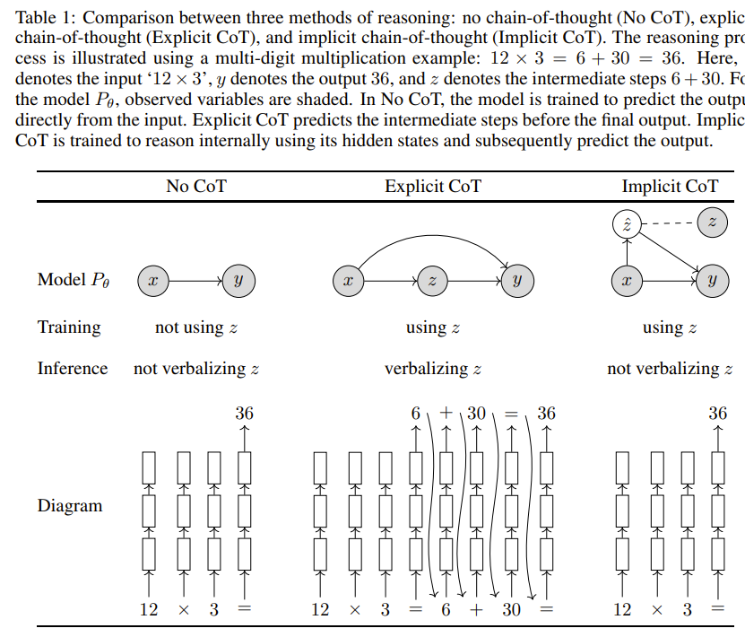

# Thinking Tokens

**Thinking tokens** concept (also known as reasoning tokens) enables more intelligence to large models during inference. Until now, the rule to get more intelligent models was only possible through pre-training large model following the "scaling laws", i.e. adding more training data and computing to pretrain large models.

Now with the concept of "thinking tokens" you can achieve more intelligence with the introduction of an internal model reasoning while doing the next token prediction.  

> <|startofthought|> and <|endofthought|>

The idea of thinking tokens has been introduced by some authors such as [Quiet-STaR: Language Models Can Teach Themselves to Think Before Speaking](https://arxiv.org/abs/2403.09629) and latest [o1 model](https://platform.openai.com/docs/guides/reasoning) from OpenAI. Thinking tokens are named reasoning tokens by OpenAI.

The basic concept is to generate "thinking tokens" at inference time to help model to predict next token. A key challenge is to efficiently generate rationales at each token position in the input sequence. However, as pointed out by simply creating a separate forward pass for each token would be computationally intractable for longer sentences.

Picture:  [Quiet-STaR](https://arxiv.org/abs/2403.09629)

According to authors, this is done at the inference pass of a language model, when it produces the probability distribution over the next tokens for all input tokens.  The solution in Quiet-STaR implements it by *caching each forward pass and concatenating a diagonal attention mask to the previous attention mask. Thus each generated token attends to all of the tokens that were used to generate it, as well as itself.* But it does not consider the token on the other "counterfactual" paths.

> Interestingly, not all tokens requires equal amount of thought . 

Interestingly, not all tokens requires equal amount of thought .  Thus the thinking token technique does not benefit all tokens equally. For example the sentence "**the person is run-**", the "**ing**" is most probably the token with highest probability and there the additional thinking is unlike to improve a well-trained prediction model.

Thus complex reasoning task such as GSM8K are the ones that would benefit more from the thinking token technique.

Results:

> Amount of thinking tokens increase the accuracy of the models.

As show in figure below, more  thinking tokens improve the GSM8K accuracy as the training steps icreases. 

## Related Work:

**[Can LLMs learn to think before they speak](https://docs.google.com/presentation/d/1GmZmoWOa2O92BPrncRcTKa15xvQGhq7g4I4hJSNlC0M/edit?pli=1#slide=id.g3058058dd40_3_90)** is a question that several researchers are exploring in order to generate robust internal reasoning processes **targeting both training and inference** (ref. OpenAI o1-model).

Based on [O1 Replication Journey: A Strategic Progress Report by Qin et. al ](https://github.com/GAIR-NLP/O1-Journey?tab=readme-ov-file), the following approaches are relevant when trying to answer the question.

**Process-level Reward Model:** provide fine-grained evaluations of responses from LLMs, specially in mathematical reasoning. The PRMs technique assess model correctness while enhancing post-training quality through search methods such as Monte Carlo Tree Search.

**Chain of Thought (CoT) Theory**: CoT has advanced reasoning capabilities of LLMs, as intermediate reasoning steps has enhanced LLM performance on tasks such as arithmetic and common sense reasoning. According to researchers, CoT empowers decoder-only models as it enabled inherently serial computations.

**Internal Thought**: Represents the capability of LLMs to reflect on their reasoning and refinement of its outputs. **Quiet-STaR** is an approach which following the "Internal Thought" solution by training language models to generate rationales after each token, helping them predict and explain future text more effectively.  The work of [Zhang et. al (2024)](https://arxiv.org/pdf/2406.12050)  introduces the embedding reflection within each training instance, which encourage the models to review their decisions and consider alternatives paths. 

Source: [Zhang et. al (2024)](https://arxiv.org/pdf/2406.12050) 

**Inference Time Scaling:** the idea is that scaling inference time can provide more efficient model performance  in comparison the current scaling laws theorem (i.e. increase of number of parameters and training data volume to increase model intelligence). By allowing model more time to process and refine their outputs during inference an alternative scaling dimension appears providing resource efficiency and adaptable computation and consequently reasoning improvements through step-by-step interactive refinement. 

**Search-to-thought**: CoT has gained attention as it improve performance by generating intermediate reasoning steps without search. [Implicit Chain-of-Thought Reasoning](https://arxiv.org/pdf/2311.01460) bypass the need for generating explicit reasoning steps as it can relies on internal hidden states of the model. This is done by using knowledge distilled from a teacher model - training to generate intermediate steps, and allowing student models to solve tasks more efficiently by reasoning vertically through their internal layers (Ref. [O1 Replication Journey: A Strategic Progress Report by Qin et. al ](https://github.com/GAIR-NLP/O1-Journey?tab=readme-ov-file)).

**Source**: [Implicit Chain-of-Thought Reasoning](https://arxiv.org/pdf/2311.01460) 

**Self-improvement in LLM:** those methods rely on model learning from its outputs without human intervention. Examples are Supervised Fine Tunning (SFT) and preference optimization such as DPO. Here the quality of the model is a function of the external reward system in the form of a reward model, human evaluator or LLM-as-a-Judge prompting. However, *finding has suggested that LLM-generated texts often exhibit truncated "tails" - i.e. the distribution of generated output lacks variability found in human-generated content, and can lead to model collapse phenomenon (model converging to a narrower range of behaviors and harming performance*) (ref. [Shumailov, et. al. (2024)](https://arxiv.org/pdf/2305.17493)).

### Chain of Thought (CoT) Differences

Some differences highlighted by Quiet-STaR authors ([here](https://community.openai.com/t/papers-quiet-star-language-models-can-teach-themselves-to-think-before-speaking/686158/3)) while comparing thinking tokens to CoT are:

- Different from CoT, model is trained using RL (reinforcement learning) to generate more useful thoughts.
- Rewards model used to generate inner monologues that helps to predict text instead of answers to specific questions - less domain specific. 

As pointed by OpenAI [here](https://platform.openai.com/docs/guides/reasoning/advice-on-prompting)  CoT might undermine "thinking tokens". Thus a best practice are:

- **Avoid chain-of-thought prompts:** Since these models perform reasoning internally, prompting them to "think step by step" or "explain your reasoning" is unnecessary.
- **Limit additional context in retrieval-augmented generation (RAG):** When providing additional context or documents, include only the most relevant information to prevent the model from overcomplicating its response.

## References:

[Quiet-STaR: Language Models Can Teach Themselves to Think Before Speaking](https://arxiv.org/abs/2403.09629)

[Reasoning Models by OpenAI](https://platform.openai.com/docs/guides/reasoning)

 [O1 Replication Journey: A Strategic Progress Report by Qin et. al ](https://github.com/GAIR-NLP/O1-Journey?tab=readme-ov-file)

[State of AI Report 2024 by Nathan Benaich](https://www.stateof.ai/)

