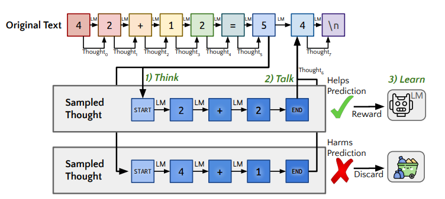
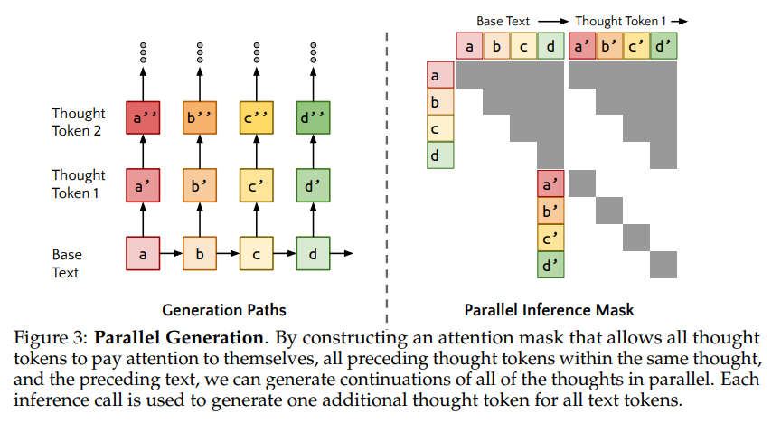
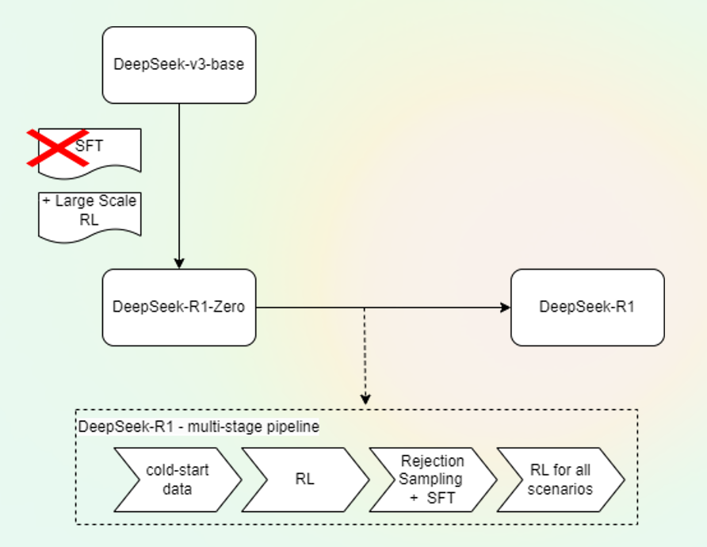
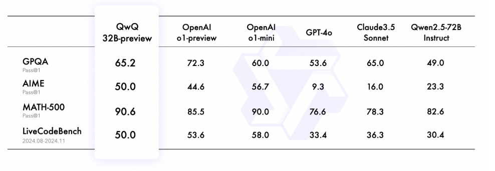
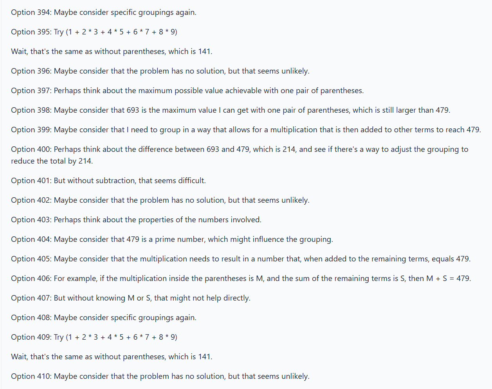

# Thinking Tokens

**Thinking tokens** concept (also known as reasoning tokens) enables more intelligence to large models during inference. Until now, the rule to get more intelligent models was only possible through pre-training large model following the "scaling laws", i.e. adding more training data and computing to pretrain large models.

Now with the concept of "thinking tokens" you can achieve more intelligence with the introduction of an internal model reasoning while doing the next token prediction.  

> <|startofthought|> and <|endofthought|>

The idea of thinking tokens has been introduced by some authors such as [Quiet-STaR: Language Models Can Teach Themselves to Think Before Speaking](https://arxiv.org/abs/2403.09629) and latest [o1 model](https://platform.openai.com/docs/guides/reasoning) from OpenAI. Thinking tokens are named reasoning tokens by OpenAI.

The basic concept is to generate "thinking tokens" at inference time to help model to predict next token. A key challenge is to efficiently generate rationales at each token position in the input sequence. However, as pointed out by simply creating a separate forward pass for each token would be computationally intractable for longer sentences.

Picture:  [Quiet-STaR](https://arxiv.org/abs/2403.09629)

According to authors, this is done at the inference pass of a language model, when it produces the probability distribution over the next tokens for all input tokens.  The solution in Quiet-STaR implements it by *caching each forward pass and concatenating a diagonal attention mask to the previous attention mask. Thus each generated token attends to all of the tokens that were used to generate it, as well as itself.* But it does not consider the token on the other "counterfactual" paths.

> Interestingly, not all tokens requires equal amount of thought . 

Interestingly, not all tokens requires equal amount of thought .  Thus the thinking token technique does not benefit all tokens equally. For example the sentence "**the person is run-**", the "**ing**" is most probably the token with highest probability and there the additional thinking is unlike to improve a well-trained prediction model.

Thus complex reasoning task such as GSM8K are the ones that would benefit more from the thinking token technique.

Results:

> Amount of thinking tokens increase the accuracy of the models.

As show in figure below, more  thinking tokens improve the GSM8K accuracy as the training steps icreases. 

## Related Work:

**[Can LLMs learn to think before they speak](https://docs.google.com/presentation/d/1GmZmoWOa2O92BPrncRcTKa15xvQGhq7g4I4hJSNlC0M/edit?pli=1#slide=id.g3058058dd40_3_90)** is a question that several researchers are exploring in order to generate robust internal reasoning processes **targeting both training and inference** (ref. OpenAI o1-model).

Based on [O1 Replication Journey: A Strategic Progress Report by Qin et. al ](https://github.com/GAIR-NLP/O1-Journey?tab=readme-ov-file), the following approaches are relevant when trying to answer the question.

**Process-level Reward Model:** provide fine-grained evaluations of responses from LLMs, specially in mathematical reasoning. The PRMs technique assess model correctness while enhancing post-training quality through search methods such as Monte Carlo Tree Search.

**Chain of Thought (CoT) Theory**: CoT has advanced reasoning capabilities of LLMs, as intermediate reasoning steps has enhanced LLM performance on tasks such as arithmetic and common sense reasoning. According to researchers, CoT empowers decoder-only models as it enabled inherently serial computations.

**Internal Thought**: Represents the capability of LLMs to reflect on their reasoning and refinement of its outputs. **Quiet-STaR** is an approach which following the "Internal Thought" solution by training language models to generate rationales after each token, helping them predict and explain future text more effectively.  The work of [Zhang et. al (2024)](https://arxiv.org/pdf/2406.12050)  introduces the embedding reflection within each training instance, which encourage the models to review their decisions and consider alternatives paths. 

Source: [Zhang et. al (2024)](https://arxiv.org/pdf/2406.12050) 

**Inference Time Scaling:** the idea is that scaling inference time can provide more efficient model performance  in comparison the current scaling laws theorem (i.e. increase of number of parameters and training data volume to increase model intelligence). By allowing model more time to process and refine their outputs during inference an alternative scaling dimension appears providing resource efficiency and adaptable computation and consequently reasoning improvements through step-by-step interactive refinement. 

**Search-to-thought**: CoT has gained attention as it improve performance by generating intermediate reasoning steps without search. [Implicit Chain-of-Thought Reasoning](https://arxiv.org/pdf/2311.01460) bypass the need for generating explicit reasoning steps as it can relies on internal hidden states of the model. This is done by using knowledge distilled from a teacher model - training to generate intermediate steps, and allowing student models to solve tasks more efficiently by reasoning vertically through their internal layers (Ref. [O1 Replication Journey: A Strategic Progress Report by Qin et. al ](https://github.com/GAIR-NLP/O1-Journey?tab=readme-ov-file)).

**Source**: [Implicit Chain-of-Thought Reasoning](https://arxiv.org/pdf/2311.01460) 

**Self-improvement in LLM:** those methods rely on model learning from its outputs without human intervention. Examples are Supervised Fine Tunning (SFT) and preference optimization such as DPO. Here the quality of the model is a function of the external reward system in the form of a reward model, human evaluator or LLM-as-a-Judge prompting. However, *finding has suggested that LLM-generated texts often exhibit truncated "tails" - i.e. the distribution of generated output lacks variability found in human-generated content, and can lead to model collapse phenomenon (model converging to a narrower range of behaviors and harming performance*) (ref. [Shumailov, et. al. (2024)](https://arxiv.org/pdf/2305.17493)).

### Chain of Thought (CoT) Differences

Some differences highlighted by Quiet-STaR authors ([here](https://community.openai.com/t/papers-quiet-star-language-models-can-teach-themselves-to-think-before-speaking/686158/3)) while comparing thinking tokens to CoT are:

- Different from CoT, model is trained using RL (reinforcement learning) to generate more useful thoughts.
- Rewards model used to generate inner monologues that helps to predict text instead of answers to specific questions - less domain specific. 

As pointed by OpenAI [here](https://platform.openai.com/docs/guides/reasoning/advice-on-prompting)  CoT might undermine "thinking tokens". Thus a best practice are:

- **Avoid chain-of-thought prompts:** Since these models perform reasoning internally, prompting them to "think step by step" or "explain your reasoning" is unnecessary.
- **Limit additional context in retrieval-augmented generation (RAG):** When providing additional context or documents, include only the most relevant information to prevent the model from overcomplicating its response.

## Latest Developments:

### DeepSeek-R1 by DeepSeek AI lab 

> DeepSeek-R1: more intelligence via inference-time scaling through increasing the length of the Chain-of-Though reasining process.

#### Introduction

**DeepSeek-R1** demonstrates that reasoning capabilities can be improved through large-scale Reinforcement Learning (RL) even without using supervised fine-tuning (SFT) as a cold start.

By incorporating multi-stage training and cold-start data before RL, DeepSeek-R1 has achieved performance comparable to latest top closed-models such as OpenAI-o1-1217 on reasoning tasks.

#### What is DeepSeek-R1

DeepSeek-R1 is the based on the DeepSeek-R1-Zero model which is the DeepSeek-v3-base model with large scale RL without SFT. DeepSeek-R1-Zero encountered challenges in relation to poor readability and language mixing. DeepSeek-R1 address this issue by incorporating multi-stage training and cold-start data before RL.

 

The **multi-stage pipeline** is composed by the following steps:

1. Several thousands of cold-start Chain of Thought (CoT) data to fine-tune the base model
2. Reinforcement Learning stage using GPRO and similar to DeepSeek-R1-Zero.
3. A SFT through rejection sampling data plus supervised data from DeepSeek-v3 in domains such as writing, factual QA and self-cognition  -> ~600k data points
4. Additional RL with prompts in order to make the model harmless/helpful, etc.

The **cold-start** are long Chain-of-through data used to to fine-tune the model. Cold-start data brings readability advantages by including a summary at the end of each response and filtering out responses that are no reader-friendly following the pattern: |speacial_token | <reasoning_process> | special_token | < summary >.

 The **Reinforced Learning** (RL) technique used is named GRPO ([Group Relative Policy Optimization](https://arxiv.org/abs/2402.03300)) which unlike traditional RL methods which rely heavily on external evaluators (critics) to guide learning, GRPO optimizes the model by evaluating groups of responses relative to one another. More information on GRPO on the paper [DeepSeekMath: Pushing the Limits of Mathematical Reasoning in Open Language Models](https://arxiv.org/abs/2402.03300).  

GRPO mainly uses 2 reward functions:

- accuracy rewards: which evaluates whether the response is correct. (e.g. math problem with deterministic results and final answer, unit tests for code as accuracy computation).

- format rewards: which enforces thinking process by rewarding model if it separates the "thinking" and the "answer" parts by <think> tags.

> The self-evolution process of DeepSeek-R1 is fascinating as it demonstrate how RL can drive the model to improve its reasoning capabilities autonomously. By initiating RL directly from the base model,a authors can monitor model progression without the influence of the supervised fine -tuning stage - indicating how model evolves overtime and its ability to handle complex reasoning tasks by leveraging extended **test-time computing**.

The **"aha moment"**: The model self-evolution through RL indicates its capability to reflect by revisiting and reevaluating previous steps and exploring alternative approaches through problem solving by using extended test-time computing during reasoning.

In addition to RL, DeepSeek-R1-Zero can be further augmented through the application of majority voting.

**Rejection sampling and SFT** is applied using data from other domains to enhance the model's capability in writing, role-playing and other general-purpose tasks. For reasoning data this is done using generative reward model with ground-truth and DeepSeek-v3 as a judge (i.e. 600k reasoning training samples in total). For non-reasoning data such as writing, factual QA, self-cognition and translation, the DeepSeek-v3 pipeline is used including reuse of portions of the SFT dataset of DeepSeek-v3 (200k training samples in total). 

**RL for all scenarios** is used to further align the model with human preferences through a secondary RL stage to improve model helpfulness and harmlessness. Rule-based rewards is used to guide the learn process in math, code and logical reasoning domains, using the same distribution of preference pairs and training prompts used by DeepSeek-v3 pipeline.

**Distilled Models**

Fine-tuning is used as a distillation method to empower small models with reason capabilities like DeepSeek-R1. DeepSeek released 6 dense models (1.5B - 70B range) based on Qwen/Llama and distilled from DeepSeek-R1 using 800k curated samples. For distilled modes only SFT is applied (no RL stage included).

**Other interesting points:**

- Despite advocating that model distillation are both economical and effective methods, the authors highlight that advancements beyond the boundaries of intelligence may still require **powerful base models** and **large-scale RL**.
- Monte Carlo Tree Search (MCTS), which is used by AlphaGo and AlphaZero, has also been proposed as a technique to enhance test-time compute scalability. But DeepSeek authors has show scaling limitation during training as token generation presents an exponentially large search space compared to chess. 
- DeepSeek-v3-base is used as the base model for DeepSeek-R1 and follows a Mixture of Expert (MoE) architecture. It has 671 billion parameters where 37 billion is activated for each token. See my previous post [Understanding Mixture of Expert](https://marcelcastrobr.github.io/posts/2024-05-19-UnderstandingMistureOfExperts.html) for additional information.
- DeepSeek-v3-base uses Multi-Head Latent Attention (MLA) as its attention mechanism. MLA proposes a low-rank joint compression for the attention keys and values in order to reduce KV(Key-Value) cache during inference. See the Multi-Head Latent Attention section in my post [The Power of Focus: Understanding Attention Mechanisms in LLM](https://marcelcastrobr.github.io/posts/2025-01-03-OptimizingLLMAttention.html#multi-head-latent-attention) for more information and references.

#### **References:**

- [DeepSeek-R1 Technical Report](https://github.com/deepseek-ai/DeepSeek-R1/blob/main/DeepSeek_R1.pdf)
- [DeepSeek-R1: Incentivizing Reasoning Capability in LLMs via Reinforcement Learning by DeepSeek-AI](https://arxiv.org/abs/2501.12948) 
- [The Math Behind DeepSeek: A Deep Dive into Group Relative Policy Optimization (GRPO) by Ahmed](https://medium.com/@sahin.samia/the-math-behind-deepseek-a-deep-dive-into-group-relative-policy-optimization-grpo-8a75007491ba) 
- [The Ilustrated DeepSeek-R1 by Jay Alammar](https://newsletter.languagemodels.co/p/the-illustrated-deepseek-r1)

By the way you can use the [DeepSeek’s AI assistant](https://cdn.deepseek.com/download-app/index.html) app in the Apple App Store.

### Marco-o1 by MacoPolo Team in Alibaba

Marco-o1 is inspired by OpenAI o1 and leverages different techniques such as:

- **CoT (Chain of Thought) fine-tuning** 
- **MCTS  (Monte Carlo Tree Search):** allow exploration of multiple reasoning paths using confidence scores derived from softmax-applied log probability of the top-k alternative tokens.
- **Reasoning Action Strategies:** allow to vary granularity of actions within steps and mini-steps to optimize search efficiency and accuracy - 

Marco-o1 is a fine tuning of Qwen2-7B-Instruct with a combination of filtered Open-O1 CoT dataset, Marco-o1 CoT dataset and Marco-o1 instruction dataset.

Picture from [Marco-o1](https://arxiv.org/pdf/2411.14405v2)

#### **MCTS  (Monte Carlo Tree Search):

The Monte Carlo Tree Search enhance the reasoning capability of the model and it is integrated in the model as following:

- **Nodes as reasoning states:** each node represents a reasoning state of the problem-solving process.
- **Actions as LLM outputs**: the possible actions from a node are the LLM generated outputs. Each output is a potential step or mini-step in the reasoning chain.
- **Rollout and reward calculation**: during rollout, the LLM continues the reasoning to a terminal state.
- **Guiding MCTS**: the reward score R is used to evaluate and select promising paths within the MCTS, guiding the search towards a reliable reasoning chains.

Figure above show ***v***, the average confidence score across all tokens to derive the overall **reward score**. Where n is the total number of tokens in the rollout sequence. A higher v indicates a more confident and accurate reasoning path.

The confidence score of each state *c* is calculated by applying a softmax function to its log probability and the log probabilities of the top 5 alternative tokens. Thus *ci* is the confidence score for the ith token in the rollout. 
$$
c_{i} = \frac{exp(p(t_{i}))}{\sum_{k=1}^{5}{exp(p(t_{k}))}}
$$

#### Reasoning Action Strategies:

Reasoning action strategies is implemented to allow different levels of granularity in the MCTS search. For example, the concept of **mini-steps** represents a search space in MCTS in steps composed by smaller units of 64 or 32 tokens. According to authors, it is impractical due to computational resources to execute token level search. 

- **step as action**: model generate complete reasoning steps as actions, where each MCTS node represents an entire thought or action label. 
- **Mini-step as action**:  mini-steps of 32 or 64 tokens used as action giving finer granularity to expand the solution space and improve model ability to reasoning tasks by considering mode nuances steps in the search process.

A reflection mechanism “***Wait! Maybe I made some mistakes! I need to rethink from scratch.***" is added at the end of each though process. This allow the model to self reflect and reevaluate its reasoning steps. As described by [authors](https://arxiv.org/pdf/2411.14405v2), the reflection step serves as an internal feedback loop allowing the model to self correct without external intervention. 

### Experiences with [QnQ](https://huggingface.co/spaces/Qwen/QwQ-32B-preview):

**Qwen with Questions (QwQ)** from Alibaba is a strong open-source competitor to OpenAI's GPT-o1 reasoning model. QwQ is available in a 32-billion-parameter preview version with a 32,000-token context.

Based on the blog [QwQ: Reflect Deeply on the Boundaries of the Unknown](https://qwenlm.github.io/blog/qwq-32b-preview/), QnQ has provided important capabilities in challenging mathematical and programming datasets, like:

- **GPQA**: A Graduate-Level Google-Proof Q&A Benchmark, a challenging benchmark for evaluating scientific problem-solving abilities through grade school level questions.
- **AIME**: American Invitation Mathematics Evaluation, which tests mathematical problem solving with arithmetic, algebra, counting, geometry, number theory, and probability and other secondary school math topics.
- **MATH-500**: The 500 test cases of the MATH benchmark, a comprehensive dataset testing mathematical problem-solving.
- **LiveCodeBench**: A challenging benchmark for evaluating code generation and problem solving abilities in real-world programming scenarios.

Results below show QnQ graduate-level scientific reasoning.

To verify it, I used the QnQ model deployed in HuggingFace [here](https://huggingface.co/spaces/Qwen/QwQ-32B-preview) and prompted the same question as in the blog. See section below the "not-so-great" results, which does not follow the results shown by the blog.

#### Experiments with QnQ 32B preview 

**Prompt**: Please add a pair of parentheses to the incorrect equation: 1 + 2 * 3 + 4 * 5 + 6 * 7 + 8 * 9 = 479, to make the equation true. 

**Answer**: No

**Date:** 02.12.2024

## References:

[Quiet-STaR: Language Models Can Teach Themselves to Think Before Speaking](https://arxiv.org/abs/2403.09629)

[Reasoning Models by OpenAI](https://platform.openai.com/docs/guides/reasoning)

 [O1 Replication Journey: A Strategic Progress Report by Qin et. al ](https://github.com/GAIR-NLP/O1-Journey?tab=readme-ov-file)

[State of AI Report 2024 by Nathan Benaich](https://www.stateof.ai/)

**Model:** [Marco-o1: Towards Open Reasoning Models for Open-Ended Solutions](https://arxiv.org/pdf/2411.14405v2)

**Model:** [Open O1: A Model Matching Proprietary Power with Open-Source Innovation](https://github.com/Open-Source-O1/Open-O1)

**Dataset:** [Open O1 SFT](https://huggingface.co/datasets/O1-OPEN/OpenO1-SFT?row=14) 

[Awesome-LLM-Strawberry -OpenAI Strawberry(o1) and Reasoning](https://github.com/hijkzzz/Awesome-LLM-Strawberry)

[Teaching Machines to Reason by Diamantai](https://diamantai.substack.com/p/teaching-machines-to-reason?r=336pe4&utm_campaign=post&utm_medium=web&triedRedirect=true)

