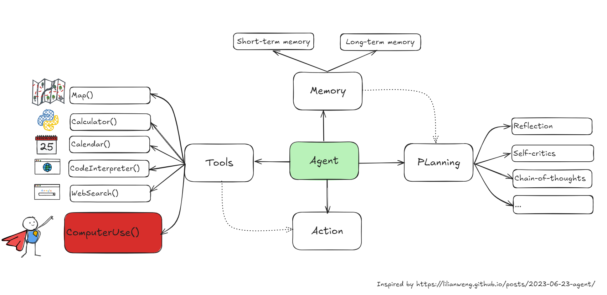
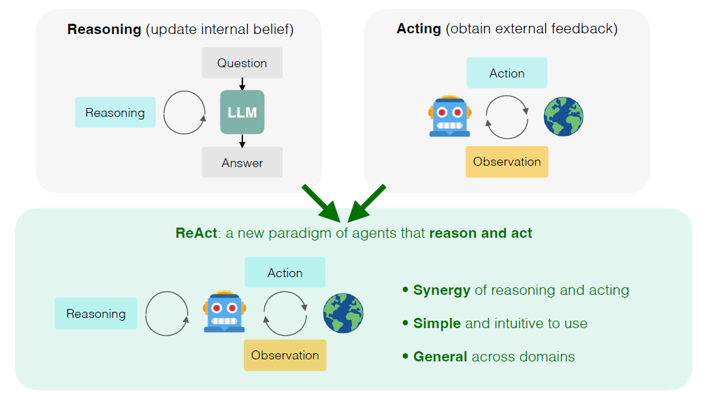
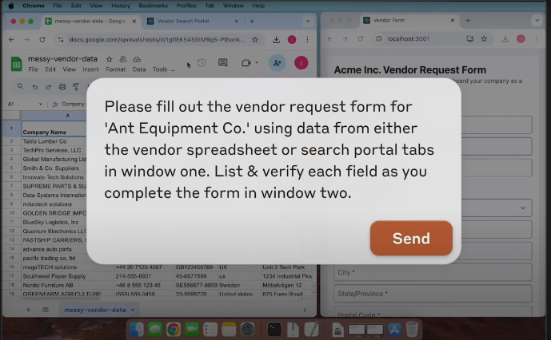

# :baby: AI Agents Revolution

In the context of Large Language Models (LLMs), AI Agents are autonomous software entities designed to extend the capabilities of LLMs. 

Recently , we have seen several agent frameworks such as [AutoGen](https://microsoft.github.io/autogen/0.2/), [CrewAI](https://www.crewai.com/) and [LangGraph](https://langchain-ai.github.io/langgraph/) and examples such as [AutoGPT](https://github.com/Significant-Gravitas/AutoGPT) and [BabyAGI](https://github.com/yoheinakajima/babyagi). 

These solutions leverage LLM capabilities and typically consist of the following steps:

- :page_facing_up: **Task decomposition**: break complex tasks into smaller, manageable steps.
- :hammer_and_pick: **Tool integration**: LLM interacting with various tools and APIs to gather data from the environment, such as web scraping tools, calculator and python interpreter.
- :books: **Memory**: used to retain information from past interactions, allowing to provide more context information.
- :currency_exchange: **Autonomous execution**: once plan is established, the agent can execute the steps autonomously.

These steps make AI agents powerful as they extend the functionality of LLMs beyond simple generation tasks towards autonomous task execution. For example, [ReAct](https://arxiv.org/abs/2210.03629) (Reasoning and Acting) is a common methodology applied to AI agents to improve performance by leveraging reasoning and acting capabilities.

Picture by [Shunyu Yao - LLM Agents - Brief History and Overview](https://rdi.berkeley.edu/llm-agents-mooc/slides/llm_agent_history.pdf)

## :question: What has changed?

So far, AI agent frameworks have needed to communicate with the outside world through tool integration in the form of APIs. However, today Anthropic announced a new approach—**LLMs performing tasks directly on your computer**.

This is possible using **[computer use capability](https://www.anthropic.com/news/3-5-models-and-computer-use)** available in Claude 3.5 sonnet and Claude 3.5 Haiku. 

> Available [today on the API](https://docs.anthropic.com/en/docs/build-with-claude/computer-use?ref=platformer.news), developers can direct Claude to use computers the way people do—by looking at a screen, moving a cursor, clicking buttons, and typing text. Claude 3.5 Sonnet is the first frontier AI model to offer computer use in public beta. At this stage, it is still [experimental](https://www.anthropic.com/news/developing-computer-use?ref=platformer.news) — at times cumbersome and error-prone. We're releasing computer use early for feedback from developers, and expect the capability to improve rapidly over time.

According to [Anthropic](https://www.anthropic.com/news/3-5-models-and-computer-use), instead of creating specific tools to help Claude complete individual tasks, we’re **teaching it general computer skills**—allowing it to use a wide range of standard tools and software programs designed for people.

Examples of Anthropic's computer use capability include:

- Creating an entire website on the user's computer and even fixes bugs in the code [[here](https://www.youtube.com/watch?v=vH2f7cjXjKI)].
- Using data from user's computer and online data to fill out forms [[here](https://www.youtube.com/watch?v=ODaHJzOyVCQ&feature=youtu.be)]. 
- Orchestrating a multi-step task by searching the web, using native applications, and creating a plan with the resulting information [[here](https://www.youtube.com/watch?v=jqx18KgIzAE)].

Figure below shows the prompt for the example "Using data from user's computer and online data to fill out forms"  from [youtube video: Computer use for automating operations](https://youtu.be/ODaHJzOyVCQ).

Picture by Anthropic's new computer use tool from [Youtube Computer use for automating operations video](https://youtu.be/ODaHJzOyVCQ).

## References:

- [AI Agents: Key Concepts and How They Overcome LLM Limitations by TheNewStack]([AI Agents: Key Concepts and How They Overcome LLM Limitations - The New Stack](https://thenewstack.io/ai-agents-key-concepts-and-how-they-overcome-llm-limitations/))
- [Introducing computer use, a new Claude 3.5 Sonnet, and Claude 3.5 Haiku by Anthropic](https://www.anthropic.com/news/3-5-models-and-computer-use) (20241022)
- [Berkley Course: Large Language Model Agents by](https://llmagents-learning.org/f24) [Dawn Song](https://people.eecs.berkeley.edu/~dawnsong/)
- [The AI agents have arrived by Casey Newton](https://www.platformer.news/anthropic-ai-agents-computer-use-consequences/?ref=platformer-newsletter)
- [When you give a Claude a mouse by Ethan Mollick](https://www.oneusefulthing.org/p/when-you-give-a-claude-a-mouse?utm_campaign=post&utm_medium=web&ref=platformer.news)
- [LLM Powered Autonomous Agents | Lil'Log](https://lilianweng.github.io/posts/2023-06-23-agent/)

