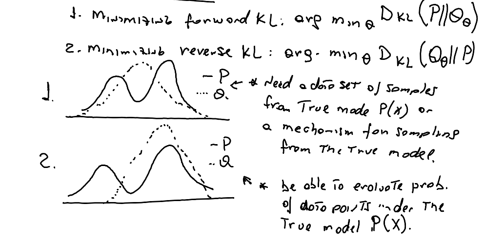

# What KL Divergence has to do with Large Language Model (LLM) Training

KL divergence, or **Kullback-Leibler divergence**, is a statistical measure used in machine learning to quantify the difference between two probability distribution. 

KL divergency, also know as **KL regularization** essentially tell us how much information is lost when one probability distribution is used to approximate another.

First we are going to discuss how KL-divergence related to LLMs and introduce KL-divergence and examples later.

## How KL Divergence relates to Large Language Model Training 

Large Language Model (LLM) training is composed by both pre-training and post-training actions.  According to [Llama 3 report](https://arxiv.org/abs/2407.21783), the pre-training actions involves, data curation, model architecture choice and efficient pre-training techniques . 

In post-training, the pre-trained model is aligned with human feedback though techniques that involves Supervised Finetuning (SFT) followed by  Reinforcement Learning Human Feedback (RLHF) or Direct Preference Optimization (DPO). 

The alignment with human behavior is desired as described by [Rafailov](https://arxiv.org/pdf/2305.18290): 

> "*we might want our language model to be aware of a common misconception believed by 50% of people, but we certainly do not want the model to claim this misconception to be true in 50% of queries about it! In other words, selecting the model’s desired responses and behavior from its very wide knowledge and abilities is crucial to building AI systems that are safe, performant, and controllable*"

In **RLHF**, you first fit a reward model that reflects human preferences, and then fine-tune the large unsupervised model using **Reinforcement Learning (RL)** to maximize the estimated reward without drifting too far from the original model. In summary, RLHF first learn a reward and then optimize it via RL.

On the other hand **DPO** does not require a reward model, but instead relies on a theoretical preference model that measures how well a given reward function aligns with empirical preference data. Giving a dataset of human preferences over model responses, DPO can therefore optimize a policy using binary cross entropy objective, without explicitly learning a reward function or sampling from the policy during training.  In summary, DPO bypasses the reward modeling step and directly optimizes a language model using preference data (i.e. transform a loss function over reward function into a loss function over policies).

Lately, several new LLM training has used DPO instead of RLHF as done in [Llama 3](https://arxiv.org/abs/2407.21783) and [Zephyr](https://arxiv.org/pdf/2310.16944).

DPO implicitly optimize the same objective as existing RLHF algorithms, which is **reward maximization with a KL-divergence constraint** - i.e. to ensure that  the fine-tuned model does not deviate too much from the original pre-trained model. 

In other words, the KL-divergence reward maximization objective balances exploitation of reward while restricting the policy from deviating far from the reference policy. Ref. Figure 2 in  [Rafailov](https://arxiv.org/pdf/2305.18290) to see the comparison of RLHF and DPO algorithms plotting reward versus KL-divergence (a.k.a KL-discrepancy).

Picture by: [Rafailov](https://arxiv.org/pdf/2305.18290) 

## What is KL Divergence

KL-divergence or KL regularization is a way to measure difference between two probability distribution. 

KL is expressed as:
$$
D_{KL}(P∥Q)=E_{x∼P}[log\frac{P(X)}{Q(X)}]
$$
Where P(x) is the true distribution and Q(x) is the approximated distribution.

**Some properties of KL-divergence:**

1) not symmetric. 
   $$
   D_{KL}(P∥Q) \neq D_{KL}(Q∥P)
   $$

2) Take only value from [0, inf]

It can also be re-written as:

$$
D_{KL}(P∥Q)=E_{x∼P}[-logQ(X)] - H(P(X))
$$
where the first term is the cross-entropy between P and Q and the last term is the entropy of P.

### Forward versus Reverse KL and its role in Machine Learning

There are two main optimizations of KL-divergence:

1. **Forward KL Divergence**: This optimization minimizes the divergence from the true distribution (P) to the approximate distribution (Q). This approach is often used in variational inference where the goal is to approximate a complex distribution (P) with a simpler distribution (Q). Mathematically, it is represented as: 
   $$
   [ \text{argmin}_\theta D_{KL}(P \parallel Q_\theta) ]
   $$
   

2. **Reverse KL Divergence**: This optimization minimizes the divergence from the approximate distribution (Q) to the true distribution (P). This method is commonly used in scenarios where the approximate distribution (Q) is simpler to compute, such as in certain machine learning algorithms. Mathematically, it is represented as: 

   
   $$
   [ \text{argmin}_\theta D_{KL}(Q_\theta \parallel P) ]
   $$

Supervised learning algorithms such as classification (with cross entropy loss) and regression (with mean-square error loss) follow the forward KL as it has equivalent objectives. Reinforcement learning approaches follow reverse KL.

Picture by Marcel (inspired by [The RL Probabilist](https://dibyaghosh.com/blog/probability/kldivergence.html) .

## References:

- [Direct Preference Optimization: Your Language Model is Secretly a Reward Model by Rafailov](https://arxiv.org/abs/2305.18290)
- [**The Llama 3 Herd of Model by Meta**](https://arxiv.org/abs/2407.21783)
- [KL Divergence for Machine Learning by The RL Probabilist](https://dibyaghosh.com/blog/probability/kldivergence.html) 

