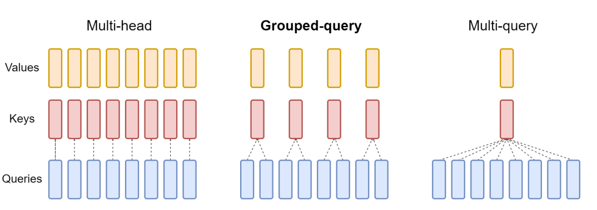
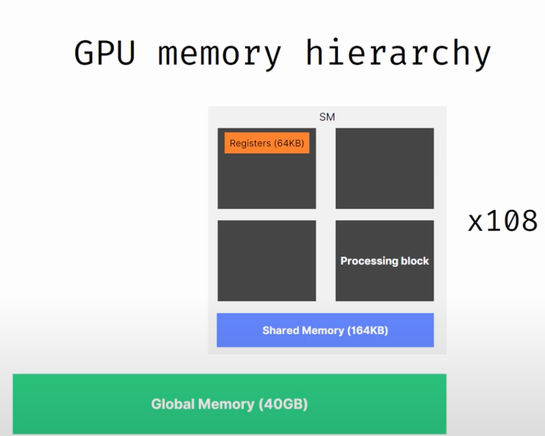
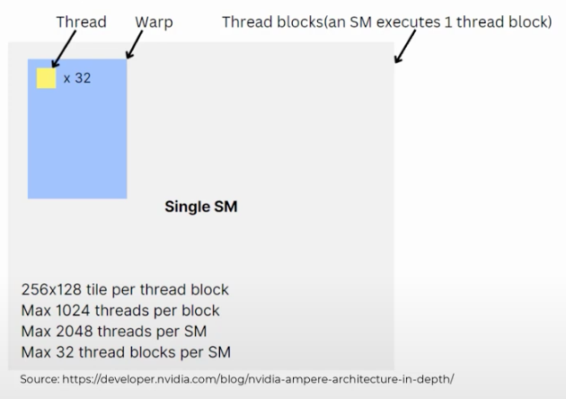

# The Power of Focus: Understanding Attention Mechanisms in LLM

[TOC]

## Background

Nowadays, there are several fronts on improving Large Language Models at both inference and training. Techniques such as quantization, distillation and optimizations at the attention mechanism are continuously been improved to either reduce model size or memory footprint.

For example, in quantization the use of **[Int8](https://arxiv.org/abs/2208.07339)** type at inference can reduce memory footprint of large models by a factor of 2x.

The sequential generation process of autoregressive transformer which generates words (tokens) one at a time based on the input prompt and previous sequence, makes the GPU workload **memory-bound**, underutilizing the computation power of GPUs and limiting the serving throughput.

In order to make sure workloads are predominantly **compute-bound** at GPUs (and not memory-bound) several solutions have been proposed to optimize the attention mechanism commonly used by autoregressive transformer, which includes **FlashAttention**,  **PagedAttention** and **Multi-Head Latent Attention** discussed below.

But before diving into those mechanism, let have a quick overview of attention mechanism. In this article we are focusing on autoregressive attention mechanism (i.e. attention for decoder-only models).


## Attention Mechanism - A Short Introduction

**A Brief history...**

Prior to Transformers, RNN (Recurrent Neural Network) was the state of the art on NLP (Natural Language Processing) tasks such as translation. But a short-coming of RNNs is that it losses context in complex sentences where dependencies span long distance. This due to the fact that the encoder-decoder RNNs was unable to direct access earlier hidden states during decoding phase and therefore RNN was forced to remember the entire encoded input in a single hidden state before passing it to the decoder. [[S Raschka](https://github.com/rasbt/LLMs-from-scratch/)].

Bahdanau attention mechanism for RNN was proposed in 2014 as a way for RNN to selective access different parts of the input sequence at each decoding step. The Transformer architecture included the self-attention mechanism inspired by Bahdanau attention mechanism. The basic idea of the attention mechanism is to identify high correlation patterns among words in a given sentence, assuming it has learned word correlation patterns from the training data.

**How Self-Attention works ...**

The diagram below from [Wikipedia](https://en.wikipedia.org/wiki/Attention_%28machine_learning%29) shows the attention forward pass calculation correlations of the word "that" with the other words in the sentence " See that girl run." Basically, given the right weights from training, the network can identify "girl" as the next token (i.e. highest correlated word in the sentence).


Picture by [Wikipedia](https://en.wikipedia.org/wiki/Attention_%28machine_learning%29).


**From Self-Attention to Multi-Head Attention ...**

Multi-head attention contains multiple self-attention blocks in order to encapsulate multiple complex relationship between different items in a sequence. In practice, the implementation of multi-head attention represents multiple instances of the self-attention, each with its own weights (i.e. different learned linear projections).

Other efficient adaptation of the multi-head attention is for example the [Grouped-Query Attention](https://arxiv.org/pdf/2305.13245v3) and [Multi-Query Attention](https://arxiv.org/pdf/1911.02150). Grouped-query attention is used by models like Llama 3. 



Picture by [Multi-Query Attention](https://arxiv.org/pdf/1911.02150)


**Reference:**

- [Attention (machine learning) by Wikipedia](https://en.wikipedia.org/wiki/Attention_%28machine_learning%29)
- [A Study of Attention Mechanism by Nilesh Barla](https://medium.com/perceptronai/a-study-on-attention-mechanism-7d199cf783b6)
- [Build A Large Language Model by Sebastian Raschka](https://github.com/rasbt/LLMs-from-scratch/)
- [Hands-On Large Language Models - Language Understanding and Generation by J. Alammar](https://github.com/HandsOnLLM/Hands-On-Large-Language-Models)
- [Fast Transformer Decoding: One Write-Head is All You Need by N. Shazeer](https://arxiv.org/abs/1911.02150)
- [GQA: Training Generalized Multi-Query Transformer Models from Multi-Head Checkpoints by J. Ainslie et. al.](https://arxiv.org/pdf/2305.13245v3)


## FlashAttention

The attention layer is the main bottleneck in scaling longer sequences, as its runtime and memory increase quadratically in the sequence length [ref. [FlashAttention-2](https://arxiv.org/abs/2307.08691)]. 

To reduce computational requirement of attention on such long context, techniques such as ***FlashAttention*** has been proposed to reorder the attention computation and leverages classical techniques such as tilling and recomputation, to speed up and reduce memory usage from quadratic to linear in sequence length (**2-4x faster** than a standard attention implementation). 

To check the list of flash attention adopters, check https://github.com/Dao-AILab/flash-attention/blob/main/usage.md

Before diving into Flash Attention we need to introduce the GPU hardware characteristics 

##### GPU Hardware Characteristics

Main components of a modern GPU are:

- On-chip SRAM (a.k.a. as shared memory e.g. A100 19TB/s - 192KB per 108 streaming)
- HBM (High Bandwidth Memory) (e.g. A100 - 40-80GB and 1.5-2.0TB/s )
- SM (streaming multiprocessor) (e.g. A100 - 108 stream multiprocessors )
  - 1 SM - 1 Thread block -> Warp (1 warp - 32 threads)




Picture By Deep Learning Hero. How does matrix multiplication work inside GPUs - https://www.youtube.com/watch?v=wIPdrbZIeKE


In GPUs, operations are executed in threads (a.k.a. kernel). Threads are organized into thread blocks, which are scheduled to run on streaming multiprocessors (SMs)

Within each thread blocks, threads are grouped into warps ( 1 warp equal 3 threads). Threads within a warp can communicate by fast shuffe instructions or cooperate to perform matrix multiply.

Warps within a thread block can communicate by reading from and writing to shared memory. Each kernel loads inputs from HBM to registers and SRAM, computes, then writes outputs to HBM.



Picture By Deep Learning Hero. How does matrix multiplication work inside GPUs - https://www.youtube.com/watch?v=wIPdrbZIeKE


Picture by Dissecting the Ampere GPU Architecture through Microbenchmarking - https://www.nvidia.com/en-us/on-demand/session/gtcspring21-s33322/

Table below shows the comparison between certain GPU types across its main characteristics.

| GPU Type                                                     | Architecture  | SM   | HBM             | SRAM | Notes                                                        |
| ------------------------------------------------------------ | ------------- | ---- | --------------- | ---- | ------------------------------------------------------------ |
| [A100](https://www.nvidia.com/en-us/data-center/a100/)       | NVIDIA Ampere | 108  | 40 GB (1.5TB/s) |      |                                                              |
| [H100](https://developer.nvidia.com/blog/nvidia-hopper-architecture-in-depth/) | NVIDIA Hopper | 144  | 80GB (2.0TB/s)  |      | Tensor Memory Accelerator, DPX (Dynamic Programming) Instructions, FP8 Tensor Cores, DSMEM (Distributed Shared Memory) |
| [H200](https://www.nvidia.com/en-us/data-center/h200/)       | NVIDIA Hopper |      | 141GB (4.8TB/s) |      |                                                              |

### FlashAttention Solution

Lots of data loading turns computation in memory bound and not compute bound. 

For each attention head, to reduce memory reads/writes, **FlashAttention** uses *classical tiling techniques to load blocks of query, key, and value from GPU HBM (its main memory) to SRAM (its fast cache)*, compute attention with respect to that block, and write back the output to HBM. This reduction in memory reads/writes brings significant speedup (2-4x) in most cases. [ref. https://www.adept.ai/blog/flashier-attention]

The figure below is from [FlashAttention paper](https://arxiv.org/pdf/2205.14135) showing on the left that FlashAttention uses tiling to prevent materialization of the large 𝑁 × 𝑁 attention matrix (dotted box) on (relatively) slow GPU HBM.

Here in the outer loop (red arrows), FlashAttention loops through blocks of the K and V matrices and loads them to fast on-chip SRAM. In each block, FlashAttention loops over blocks of Q matrix (blue arrows), loading them to SRAM, and writing the output of the attention computation back to HBM.

On the right you see the speedup over the PyTorch implementation of attention on GPT-2. FlashAttention does not read and write the large 𝑁 × 𝑁 attention matrix to HBM, resulting in an 7.6× speedup on the attention computation according to the paper.


### FlashAttention at PyTorch

PyTorch implements flash attention at https://pytorch.org/docs/stable/generated/torch.nn.functional.scaled_dot_product_attention.html. 

Below is a code snipped example from [DeepLearning Hero](https://github.com/thushv89/tutorials_deeplearninghero/blob/master/llms/flash_attention_torch.ipynb) using pytorch.

```python
with torch.backends.cuda.sdp_kernel(
        enable_flash=False, enable_math=True, enable_mem_efficient=True
):
```

Check [FlashAttention - Fast and Memory Efficient Attention Mechanism](https://marcelcastrobr.github.io/posts/2024-04-07-flashattention.html) in  https://marcelcastrobr.github.io/ for a notebook implementation.

**References:**

- FlashAttention: Fast and Memory-Efficient Exact Attention with IO-Awareness - https://arxiv.org/abs/2205.14135
- FlashAttention-2: Faster Attention with Better Parallelism and Work Partitioning https://arxiv.org/abs/2307.08691
- Matrix Multiplication: Inner Product, Outer Product & Systolic Array https://www.adityaagrawal.net/blog/architecture/matrix_multiplication
- Benchmarking and Dissecting the Nvidia Hopper GPU Architecture https://arxiv.org/pdf/2402.13499v1
- NVIDIA Hopper Architecture In-Depth https://developer.nvidia.com/blog/nvidia-hopper-architecture-in-depth/
- FlashAttention: Fast Transformer training with long sequences  https://www.adept.ai/blog/flashier-attention
- AWS Broadcast  https://broadcast.amazon.com/videos/670513?ref=personal
- Andrej Karpathy implementation - https://twitter.com/karpathy/status/1786461447654125625?s=51
- FlashAttention - Fast and Memory Efficient Attention Mechanism by Marcel Castro - https://marcelcastrobr.github.io/posts/2024-04-07-flashattention.html


## PagedAttention

Key-value cache (KV cache) memory for each request in the attention mechanism is huge and grows and shrinks dynamically. When managed inefficiently, this memory can be significantly wasted by fragmentation and redundant duplication, limiting the batch size.

PageAttention propose to improve the LLM throughput by batching multiple requests together. Thus to process many requests in a batch needs an efficient memory management.

As discussed in [[Efficient Memory Management for Large Language Model Serving with PagedAttention](https://arxiv.org/pdf/2309.06180)] , approximately 65% of memory is allocated to mode weights which are static parameters during serving (considering a 13Billion parameter model on NVIDIA A100 GPU with 40GB RAM). Close to 30% of the memory is used to store the dynamic states of the requests (a.k.a **KV cache**). The remaining memory is used for other data such as activations.

Since model weights are constant and the activations only occupy a small fraction of the GPU memory, the way KV cache if managed is critical in determining the maximum batch size.  


Picture from Paper [Efficient Memory Management for Large Language Model Serving with PagedAttention](https://arxiv.org/pdf/2309.06180). In the Left: Memory layout when serving an LLM with 13B parameters on NVIDIA A100. The parameters (gray) persist in GPU memory throughout serving. The memory for the KV cache (red) is (de)allocated per serving request. A small amount of memory (yellow) is used ephemerally for activation. Right: vLLM smooths out the rapid growth curve of KV cache memory seen in existing systems [31, 60], leading to a notable boost in serving throughput.

PageAttention solution is inspired by the operating system solution to memory fragmentation and sharing: *virtual memory with paging*. KV cache is divided into blocks, where the blocks are not necessarily stored in contiguous space (i.e. think blocks as pages, tokens as bytes and requests as processes). This allows PagedAttention to achieve:

- near-zero waste in KV cache memory.
- flexible sharing of KV cache within and across requests to further reduce memory usage.


**References:**

- [Efficient Memory Management for Large Language Model Serving with PagedAttention - https://arxiv.org/pdf/2309.06180]


## Multi-Head Latent Attention

As pointed out by Aleksa Gordic [here](https://www.linkedin.com/posts/aleksagordic_flying-to-usa-got-some-time-to-read-deepseek-activity-7274906448378101760-KEvU?utm_source=share&utm_medium=member_desktop), Multi-Head Latent Attention (MLA) is used by [DeepSeek-v3](https://github.com/deepseek-ai/DeepSeek-V3/blob/main/DeepSeek_V3.pdf) (671Billion parameter model with 37 Billion activated for each token), currently the world's most powerful open-source LLM. As Gordic mentioned, the core idea behind MLA is to save a single low-dimension vector that gets projected back into NH (Number of Heads) keys & value vectors (via 2 learnable parameter matrices) before doing the "standard" attention.


Picture by [DeepSeek-AI](https://arxiv.org/pdf/2405.04434)


MLA proposes a low-rank joint compression for the attention keys and values in order to reduce KV(Key-Value) cache during inference.  MLA also perform a low-rank compression in the attention queries (Q) to reduce the activation memory during training.


Picture by [DeepSeek-AI](https://arxiv.org/pdf/2405.04434)

**References:**

- [DeepSeek-V2: A Strong, Economical, and Efficient Mixture-of-Experts Language Mode, by DeepSeek-AI](https://arxiv.org/pdf/2405.04434)


# More References:

- [GTC 2022 - How CUDA Programming Works - Stephen Jones, CUDA Architect, NVIDIA.](https://www.youtube.com/watch?v=QQceTDjA4f4)
- [A Gentle Introduction to 8-bit Matrix Multiplication for transformers at scale using Hugging  Face Transformers, Accelerate and bitsandbytes](https://huggingface.co/blog/hf-bitsandbytes-integration) 
- [The Ultimate Battle of Language Models: Lit-LLaMA vs GPT3.5 vs Bloom vs …](https://lightning.ai/pages/community/community-discussions/the-ultimate-battle-of-language-models-lit-llama-vs-gpt3.5-vs-bloom-vs/)
- [SageMaker JumpStartModel API Docs](https://sagemaker.readthedocs.io/en/stable/api/inference/model.html#sagemaker.jumpstart.model.JumpStartModel)
- Video: [A Survey of Techniques for Maximizing LLM Performance, by OpenAI DevDay](https://www.youtube.com/watch?v=ahnGLM-RC1Y)
- Yann Lecun, New York University & META Title: Objective-Driven AI: Towards AI systems that can learn, remember, reason, and plan, [video](https://www.youtube.com/watch?v=MiqLoAZFRSE&t=3983s), [ppt](https://drive.google.com/file/d/1wzHohvoSgKGZvzOWqZybjm4M4veKR6t3/view?pli=1)
- IEEE Spectrum - 15 Graphs That Explain the State of AI in 2024  The AI Index tracks the generative AI boom, model costs, and responsible AI use https://spectrum.ieee.org/ai-index-2024 