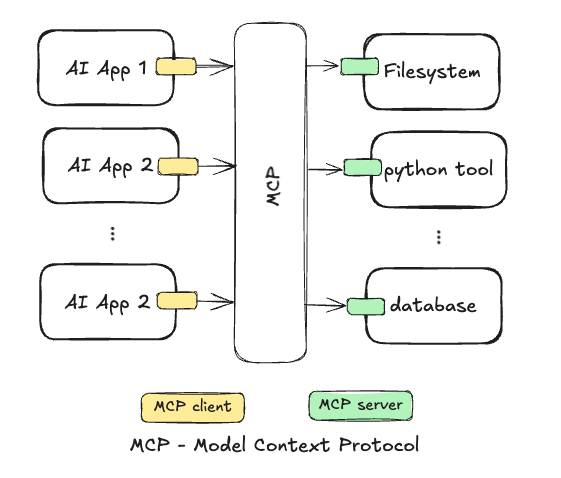

# :computer: -> :snowflake:  The Model Context Protocol (MCP) - What and How to run in Snowflake 

# 

This article provides my atempt to describe what is MCP (Model Context Protocol) and how you can use it. It will also provide examples of how to use it torwards [Snowflake Cortex Agent.](https://docs.snowflake.com/en/user-guide/snowflake-cortex/cortex-agents)


## What is MCP (Model Context Protocol)

Often described as the "**USB-C for AI Applications**". Why? Just as USB-C provides standardized interface for connecting various devices, MCP offers a protocol for connecting AI model to external capabilities, like databases, APIs, etc.


## Why MCP: The MxN Integration Challenge

With the increasing numbers of AI tools and data providers, the lack of single implementation that works with multiple AI applications becomes the **MxN intregation challenge**: M different AI applications tha needs to talk to N different external tools or data sources.


Picture by: Author


With MCP, AI applications implements the **MCP client** and the tools and data sources implements the **MCP server**.



Picture by: Author

## MCP Components

MCP follows the distributed system principle where devices (mcp clients and mcp servers) cooperate to achieve a common goal, often coodidating through a network protocol (ref. [Distributed computing by Wikepedia](https://en.wikipedia.org/wiki/Distributed_computing#:~:text=Distributed%20systems%20are%20groups%20of,coupled%20form%20of%20parallel%20computing.)).

Thus MCP components and its tasks are:

- **Host AI application:** user AI application where users interact with such as Claude Desktop, Cursor or customer applications built with libraries like LangChain and LlammaIndex.
- **MCP client**: component which is part of the host AI application managing the communication with the MCP server(s) in a 1-to-1 connection client-server.
- **MCP server**: remote server exposing capabilities such as resources, tools and prompts via the MCP protocol. It can run locally or remotely.
- **MCP Protocol**: the open protocol enabling integration between client and server based on JSON-RPC message format and stateful connections (ref. [MCP protocol specification](https://modelcontextprotocol.io/specification/2025-03-26)).


## MCP Architecture

MCP follows the client-server architecture as described below. It is a modular architecture where clients can connect to multiple servers. Given the distributed system principle in this architecture, important features such as **safety**, **extensibility** and **interoperability** is very important.


Picture by: [modelcontextprotocol.io](https://modelcontextprotocol.io/introduction)

#### **Capabilities:**

In MCP client and server run discovery message to understand which capabilities the server contains. Currently in MCP the capabilities are:

- **Tools**: Functions that can be called by the LLM (with user approval). 
  - Usecases are sending messages, creating tickets, querying APIs, performing calculations.

- **Resource**: File-like data that can be read by clients (like GET API responses or file contents).
  - Usecases are accessing file contents, retrieving database records, reading configuration information.

- **Prompts**: Pre-written templates that help users accomplish specific tasks.
  - Usecases are common workflows, specialized task templates, guided interactions.


Clients can offer **sampling**, a server-initiated agentic behaviour and recursive LLM interactions, as a feature to servers. Common usecases here are complex multi-step tasks, autonomous agent workflows, and interactive processes.

See here an example of a simple [MCP weather server in python](https://github.com/modelcontextprotocol/quickstart-resources/tree/main/weather-server-python). 


## The MCP Communication Protocol

The [Model Context Protocol](https://modelcontextprotocol.io/) (MCP) is an open protocol that enables seamless integration between LLM applications and external data sources and tools. 

MCP uses JSON-RPC 2.0 message format for client-server communication, which is a remote procedure call protocol encoded in JSON, making it human readable and language agnostic. 

The transport mechanisms are **stdio** (standard input/ouput) or **HTTP+SSE / Streamable HTTP**.

**stdio** is used for local communication where client and server run on the same host. 

**HTTP+SSE ( Server-Sent Events) / Streamable HTTP** is used for remote communication. 

> [!NOTE]
>
> Streamable HTTP replaces the [HTTP+SSE transport](https://modelcontextprotocol.io/specification/2024-11-05/basic/transports#http-with-sse) from protocol version 2024-11-05. See the [backwards compatibility](https://modelcontextprotocol.io/specification/2025-03-26/basic/transports#backwards-compatibility) guide.


Picture by: [modelcontextprotocol.io](https://modelcontextprotocol.io/introduction)

### The MCP Communication Protocol: Message Types

The messages type defined by the protocol (2025-03-26 (Latest)) are:

#### Requests

```json
{
  jsonrpc: "2.0";
  id: string | number;
  method: string; -> e.g.:  tools/calls
  params?: {
    [key: string]: unknown;
  };
}
```


#### Responses

```json
{
  jsonrpc: "2.0";
  id: string | number;
  result?: {
    [key: string]: unknown;
  }
  error?: {
    code: number;
    message: string;
    data?: unknown;
  }
}
```


#### Notifications

```json
{
  jsonrpc: "2.0";
  method: string;
  params?: {
    [key: string]: unknown;
  };
}
```

Notifications are one-way message that do not require response as it is tipically sent from server to client to provide updates and/or notifications about events.

See below the interaction between client and server using the MCP protocol message types (inspired by [MCP course by HuggingFace](https://huggingface.co/learn/mcp-course/unit1/communication-protocol)). 


The full specification of the protocol is defined as a [TypeScript schema](https://github.com/modelcontextprotocol/specification/blob/main/schema/2025-03-26/schema.ts). 


## MCP SDK - Software Defined Kit

Currently the MCP SDK is available for [Python](https://github.com/modelcontextprotocol/python-sdk), TypeScript, Java, Kotlin, C# and Swift.

The code example below from the [MCP Python SDK](https://github.com/modelcontextprotocol/python-sdk) presents a simple MCP server that expose a calculator tool and some data example .

```python
# server.py
from mcp.server.fastmcp import FastMCP

# Create an MCP server
mcp = FastMCP("Demo")


# Add an addition tool
@mcp.tool()
def add(a: int, b: int) -> int:
    """Add two numbers"""
    return a + b


# Add a dynamic greeting resource
@mcp.resource("greeting://{name}")
def get_greeting(name: str) -> str:
    """Get a personalized greeting"""
    return f"Hello, {name}!"
```


## **When to use MCP **(To Be Done)

When you need a single AI assistant to access external data or tools - like searching documents, scheduling meetings, or querying databases.

## How to use MCP in Snowflake (To Be Done)

Quickstart: https://quickstarts.snowflake.com/guide/mcp-server-for-cortex-agents/index.html
Repo: https://github.com/Snowflake-Labs/sfguide-mcp-cortex-agents


## 🤔 Things to Consider


## 📚 Reference:

- [Workflow behind MCP and A2A](https://www.linkedin.com/posts/eordax_ai-agentic-llm-activity-7323622305232744451-Ui2r?utm_source=share&utm_medium=member_desktop&rcm=ACoAAAMLrWgBHLbSh09-i54JZEgS64XZCzcR5H0)
- Course: [MCP: Build Rich-Context AI Apps with Anthropic](https://learn.deeplearning.ai/courses/mcp-build-rich-context-ai-apps-with-anthropic/lesson/f4wo9/appendix-%E2%80%93-tips-and-help)
- Course: [MCP Course by HuggingFace](https://huggingface.co/learn/mcp-course)
- [MCP server with Docker](https://github.com/daveebbelaar/ai-cookbook/tree/main/mcp/crash-course/6-run-with-docker) 
- [An Introduction to MCP and Authorization by Martinez](https://auth0.com/blog/an-introduction-to-mcp-and-authorization/)


> [!TIP]
>
> Get started with your first MCP server using Snowflake using the Snowflake Quickstart [Build an MCP Server for Cortex Agents](https://quickstarts.snowflake.com/guide/mcp-server-for-cortex-agents/index.html#0)


