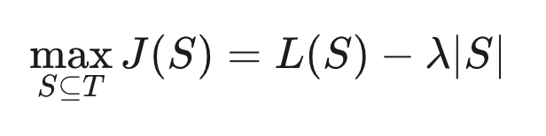
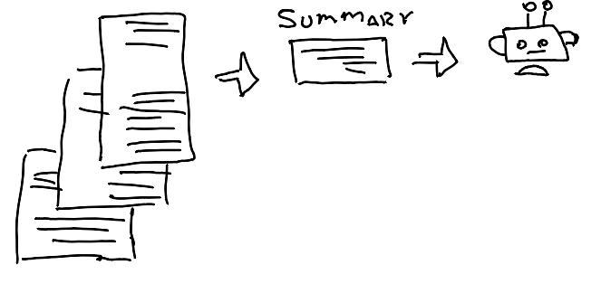
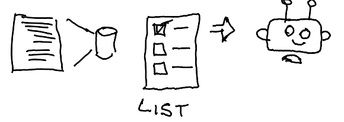
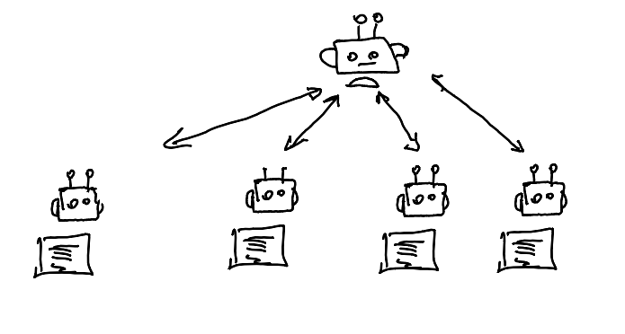

# ✨ The Next Frontier: Moving from Perfect Prompts to Optimized Context Curation ✨

> The landscape of AI interaction is shifting. While we mastered **Prompt Engineering**, the next critical skill is **Context Engineering**... 

As intelligent agents handle multi-turn, long-horizon tasks, we face a critical challenge: managing the growing volume of system instructions, history, and data efficiently. **The bottleneck isn't just LLM size—it's signal efficiency**

### **Key Definitions:**

- **Token:** A basic unit of text (often a word or part of a word) that the Large Language Model (LLM) processes.
- **Prompt:** The initial input text, question, or instruction provided to the model.
- **Context:** The full set of tokens included when sampling from a LLM.
- **Context Engineering:** The strategy to curate and maintain the **optimal set of tokens** during LLM inference to achieve reliable and cost-effective outcomes.

### The Core Challenge: Context Size vs. Attention

This new paradigm introduces a critical tension. As the overall **context length increases**, the model's ability to capture token relationships effectively decreases.

This is due to the Transformer architecture's **quadratic complexity** (every token must attend to every other token). This creates a tension where larger context often leads to reduced focus, a phenomenon known as **[context rot](https://research.trychroma.com/context-rot)** or the **"needle-in-a-haystack" problem** (as noted by Anthropic).

### The Context Engineering Objective

Good context engineering is a classic optimization problem. We must find the smallest set of high-signal tokens that maximizes the likelihood of the desired outcome.

This requires solving the core trade-off:

The goal is to find the set of tokens (S) that maximizes the score J(S) by: **Maximizing Signal (Likelihood, L(S)) while Minimizing Noise and Cost (Set Size, ∣S∣)**. The factor λ determines the necessary trade-off.

### Best Practices for Effective Context Curation

To ensure your LLM agents remain sharp and cost-efficient, implement these practices:

- **Clarity & Simplicity:** System prompts should be clear and simple, using direct language.
- **Section Organization:** Organize prompts into distinct, labeled sections (e.g., `BACKGROUND_INFORMATION`, `INSTRUCTIONS`, `TOOL_GUIDANCE`, etc.). This aids model parsing and focus.
- **Tool Efficiency:** Do not cover too much functionality in a single tool. Use tools that promote efficiency by returning information that is **token-efficient** and encourages efficient agent behavior.
- **Example Diversity:** Provide examples that are diverse but do not overload the prompt with every possible edge case.
- **"Just-in-Time" Context Strategy:** Maintain lightweight identifiers (file paths, stored queries, web links) and use these references to **dynamically load** into context at runtime using tools.
- **Hybrid Retrieval:** Maintain a **trade-off between runtime exploration and pre-computed retrieving**. A hybrid approach—retrieving some core data up front for speed and exploring further data as needed—is often most helpful.

### **Does it work for all? How about long running tasks** ?

Long-horizon tasks (spanning several minutes or hours, such as managing a large codebase) require specialized techniques to work around deep context size limitations. Anthropic proposes three main strategies here:

#### 1. Compaction or Distillation

This involves summarizing the conversation content and initiating a new context window with the summary.

Compaction is an art because it forces the dilemma of what to keep versus what to discard. A suggestion from Anthropic is to start by maximizing **recall** (capturing every relevant piece) and then iterating to improve **precision** by eliminating superfluous content.

- **Example:** Pruning or clearing detailed tool calls and their large results from the context once the agent has processed the outcome, as they aren't relevant for the next high-level interaction.

  

####  2. Structured Note-Taking / Agentic Memory

The agent regularly writes notes that are persisted to memory *outside* of the context window.

- **Example:** The agent creates a to-do list file or main task list and tracks its progress in that file as tasks are completed, retrieving the relevant status when needed.

#### 3. Sub-Agent Architectures

Instead of one agent maintaining state across an entire project, use specialized sub-agents to handle focused tasks with clean context windows.

- An **orchestration agent** manages the high-level plan.
- **Sub-agents** handle deep technical work or the use of specific tools.

This approach implements the **clear separation of concerns principle** where specific search context remains isolated within the sub-agents, allowing the orchestration agent to focus solely on synthesizing and analyzing the final results.

### The Lesson from Human Cognition

Those best practices mirror how humans manage information. We generally don't memorize an entire corpus of information but use **indexing systems** like file folders, inboxes, and bookmarks to retrieve relevant information on demand. The file size suggests complexity, and timestamps can proxy relevance—just like token efficiency and context loading in AI.

### **References:**

-  [Effective context engineering for AI agents by Anthropic](https://www.anthropic.com/engineering/effective-context-engineering-for-ai-agents)
- [How to Build an Agent by Langchain](https://blog.langchain.com/how-to-build-an-agent/)

