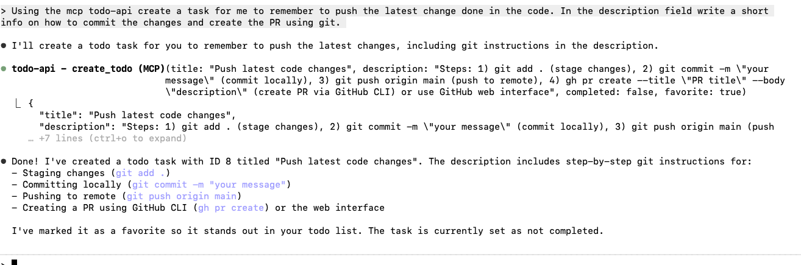
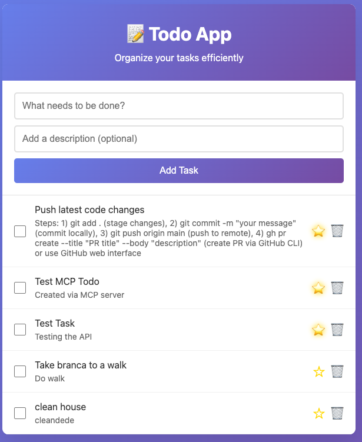
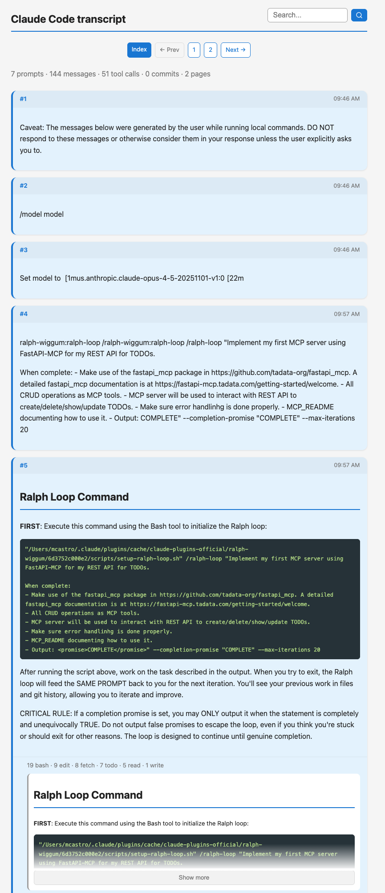

# Using Loops in Claude Code

This week I came across the concept of "**claude code loop**" which I was not aware of.  

Basically it is a term coined by [Geoffrey Huntley](https://ghuntley.com/) which describes it as a **"Ralph is a Bash loop" - a development methodology based on continuous AI agents loops** . 

Ralph in this case is named after [Ralph Wiggum from The Simpsons](https://en.wikipedia.org/wiki/Ralph_Wiggum), which represents the philosophy of **persistent interactions despite setbacks**.


## Ralph Wiggum Plugin

**Claude code loop** is implemented as a plugin named  "Ralph Wiggum Plugin"  at https://github.com/anthropics/claude-plugins-official/tree/main/plugins/ralph-wiggum.

In my case, I use the plugin to create an MCP server for my simple [REST API for managing TODO items](https://github.com/marcelcastrobr/cc-ralph-wiggum-observability) built with FastAPI and SQLAlchemy.

But before we check the results, lets look at how to install and use the Claude Code [Ralph Wiggum Plugin](https://github.com/anthropics/claude-plugins-official/tree/main/plugins/ralph-wiggum).

#### How to install the plugin

```markdown
**Install ralph-wiggum plugin:**
 /plugin install claude-plugins-official/ralph-wiggum
 
 **Remove ralph-wiggum plugin:**	
 /plugin remove ralph-wiggum
 
**Alternative installation method:**
 You can also use the interactive installer which will show available plugins:
  /plugin install
```


#### How to use the plugin

The basic concepts are:

```bash
# You run ONCE:
/ralph-loop "Your task description" --completion-promise "DONE"

# Then Claude Code automatically:
# 1. Works on the task
# 2. Tries to exit
# 3. Stop hook blocks exit
# 4. Stop hook feeds the SAME prompt back
# 5. Repeat until completion
```


I used it to add an MCP Server using the following instructions.  

```bash
/ralph-loop "Implement my first MCP server using FastAPI-MCP for my REST API for TODOs. 

When complete:
- Make use of the fastapi_mcp package in https://github.com/tadata-org/fastapi_mcp. A detailed fastapi_mcp documentation is at https://fastapi-mcp.tadata.com/getting-started/welcome.
- All CRUD operations as MCP tools.
- MCP server will be used to interact with REST API to create/delete/show/update TODOs.
- Make sure error handling is done properly.
- MCP_README documenting how to use it.
- Output: <promise>COMPLETE</promise>" --completion-promise "COMPLETE" --max-iterations 20
```

:dollar: After $1.55 , I got the following output from claude code.

```markdown
 The MCP server implementation is complete. Here's a summary of what was accomplished:
 
Summary

  Implementation Complete

  1. Installed FastAPI-MCP: Added fastapi-mcp package (v0.4.0)
  2. Modified main.py:
    - Added FastApiMCP import
    - Added operation_id to all CRUD endpoints for clear tool naming
    - Initialized MCP server with appropriate configuration
    - Mounted MCP server at /mcp using HTTP transport
    - Fixed uvicorn startup to use string import for proper route registration
  3. MCP Tools Available:
    - create_todo - Create a new todo item
    - list_todos - List todos with filtering/pagination
    - get_todo - Get a specific todo by ID
    - update_todo - Update an existing todo
    - delete_todo - Delete a todo by ID
  4. Created MCP_README.md: Comprehensive documentation including:
    - Installation instructions
    - Server startup guide
    - All 5 MCP tools with parameters and examples
    - Client configuration for Claude Desktop and Cursor
    - Error handling documentation
    - Example workflows
    - Development guide for adding new tools
  5. Error Handling: Inherited from the REST API with proper HTTP status codes (400, 404, 422, 500)
  6. Testing: All 38 existing tests pass, and manual testing with curl confirms MCP functionality works correctly

  COMPLETE
	
```


And here a detailed information on cost.

```
> /cost --session 4 
  ⎿  Total cost:            $1.55
     Total duration (API):  2m 29s
     Total duration (wall): 21m 46s
     Total code changes:    0 lines added, 0 lines removed
     Usage by model:
             claude-haiku:  695 input, 97 output, 0 cache read, 0 cache write ($0.0012)
         claude-3-5-haiku:  4 input, 387 output, 0 cache read, 2.1k cache write ($0.0037)
          claude-opus-4-1:  58 input, 2.4k output, 43.1k cache read, 69.6k cache write ($1.55)

```


## Using MCP to interact with my TODO List

In order to use the MCP server in claude code, we need to add the following configuration in the .claude/settings.json file.

```json
{
  "mcpServers": {
    "todo-api": {
      "type": "http",
      "url": "http://localhost:8000/mcp"
    }
  }
}
```

Or simply run the command:

```bash
claude mcp add todo-api http://localhost:8000/mcp --transport http
```


Once the mcp server is configured in claude code, we can use the newly created MCP tools in our claude code conversations:

 \- "Use the todo MCP server to create a new todo called 'Test MCP Integration'"

 \- "List all pending todos using the MCP server"

 \- "Mark todo ID 1 as complete"

 \- "Delete todo ID 2"

#### Creating my first task through MCP 

Here is the request I did to claude code.



And here the task **"Push latest code changes"** added to the TODO list.




## Claude Code Transcripts

I am a new user of claude code using CLI (command line). Sometimes I find it useful to check what the agent has done as a way to learn from the agent during task execution. In particular, when using  **/ralph-loop** where the idea is to have claude code to develop the whole task in a loop with minimum interuption.

In order to do it I came across the [claude-code-transcripts](https://simonwillison.net/2025/Dec/25/claude-code-transcripts/) from Simon Willison, which is a Python CLI tool that converts claude code sessions to HTML pages that can be shared through Github Gists.

You can run using:

```bash
uvx claude-code-transcripts
```

To generate Github gist, make sure you have the github authentication and run the command:

```bash
uvx claude-code-transcripts --gist

# Or if you have installed it through "uv tool install claude-code-transcripts"
claude-code-transcripts --gist
```


The result is the converted claude code session files to clean HTML pages with pagination. Thanks to [Simon Willison](https://simonwillison.net/).




Check the complete Claude Code sessions at https://gisthost.github.io/?afd5c714ea23979f214903d36bae8012/index.html


Additional claude code transcripts:

- [Implementation of MCP Server using Ralph Wiggum Plugin](https://gisthost.github.io/?afd5c714ea23979f214903d36bae8012/index.html)
- [Using MCP server created to add a new task to the TODO list.](https://gisthost.github.io/?3f83f36ac3ba7c150493406db56b257e/index.html)


## References

- [Ralph Wiggum Plugin](https://github.com/anthropics/claude-plugins-official/tree/main/plugins/ralph-wiggum)
- [claude-code-transcripts by Simon Willison](https://simonwillison.net/2025/Dec/25/claude-code-transcripts/)